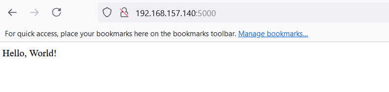

This Python Flask application runs persistently in a Docker container managed by Docker Compose, enabling easy deployment and scalability. The Docker Compose configuration ensures the Flask app starts automatically and remains accessible on the specified port, supporting a continuous and consistent runtime environment.

# Flask Application with Docker and Docker Compose

This project demonstrates how to containerize a Flask application using Docker and Docker Compose.

## Prerequisites

- Docker installed on your machine
- Docker Compose installed on your machine

## Project Structure
```bash
.
├── app.py
├── Dockerfile
├── docker-compose.yml
├── requirements.txt
└── README.md
```

## Files

- `app.py`: The Flask application code.
- `Dockerfile`: Instructions to build the Docker image.
- `docker-compose.yml`: Configuration for Docker Compose to run the application.
- `requirements.txt`: List of Python dependencies.

## Step-by-Step Guide

### 1. Create the Flask Application

Create a file named `app.py` with the following content:

```python
from flask import Flask

app = Flask(__name__)

@app.route("/")
def hello_world():
    return "<p>Hello, World!</p>"

if __name__ == "__main__":
    app.run(host="0.0.0.0", port=5000)
```

### 2. Create the Requirements File

Create a file named `requirements.txt` with the following content:

```
Flask
```

### 3. Create the Dockerfile

Create a file named `Dockerfile` with the following content:

```Dockerfile
# Use an official Python runtime as a base image
FROM python:3-alpine3.15

# Set the working directory in the container
WORKDIR /app

# Copy everything to /app
COPY . /app

# Install the dependencies specified in requirements.txt
RUN pip install -r requirements.txt

# Expose the port the Flask app will run on
EXPOSE 5000

# Set the environment variable to tell Flask to run in production mode
ENV FLASK_ENV=production

# Set the command to run the Flask app
CMD ["flask", "run", "--host=0.0.0.0"]
```

### 4. Create the Docker Compose File

Create a file named `docker-compose.yml` with the following content:

```yaml
version: '3.8'

services:
  flask-app:
    build: .
    ports:
      - "5000:5000"
    volumes:
      - .:/app
    environment:
      FLASK_ENV: production
    command: flask run --host=0.0.0.0
```

### 5. Build and Run the Application

Run the following command to build and start the services defined in the `docker-compose.yml` file:

```bash
docker-compose up --build
```

This command will:
- Build the Docker image using the Dockerfile.
- Start the Flask application in a container.
- Map port 5000 on your host to port 5000 in the container.
- Mount the current directory to `/app` in the container.
- Set the environment variable `FLASK_ENV` to `production`.
- Run the Flask application with the command `flask run --host=0.0.0.0`.

### 6. Access the Application

Once the container is running, you can access your Flask application at `http://localhost:5000`.

## Conclusion

This project demonstrates how to containerize a Flask application using Docker and Docker Compose. By following the steps outlined in this README, you can easily build and run your Flask application in a Docker container.


